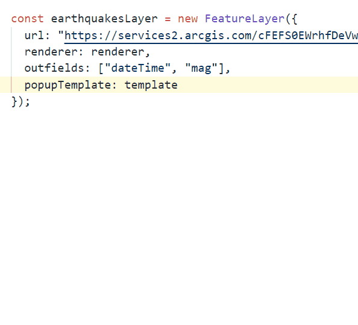
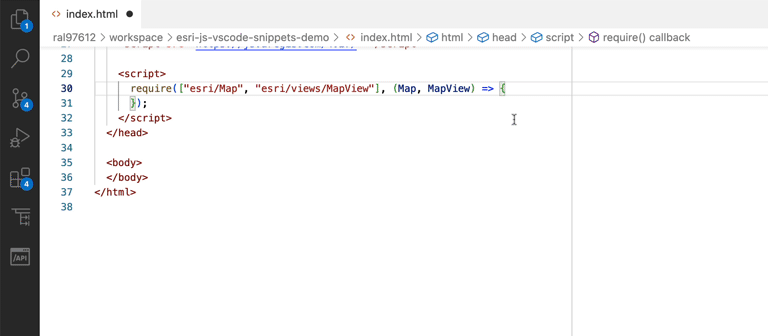

# arcgis-js-vscode-snippets

Visual Studio Code extension that contains a collection of snippets for common code patterns with [ArcGIS Maps SDK for JavaScript](https://developers.arcgis.com/javascript/).

<!-- START doctoc generated TOC please keep comment here to allow auto update -->
<!-- DON'T EDIT THIS SECTION, INSTEAD RE-RUN doctoc TO UPDATE -->
**Table of Contents**  

- [Get started](#get-started)
  - [Prerequisites](#prerequisites)
  - [Usage](#usage)
- [Snippets available](#snippets-available)
  - [HTML snippets](#html-snippets)
  - [JavaScript snippets](#javascript-snippets)
  - [TypeScript snippets](#typescript-snippets)
  - [JSON snippets](#json-snippets)
  - [TSX snippets](#tsx-snippets)
- [Issues](#issues)
- [Contributing](#contributing)
- [License](#license)

<!-- END doctoc generated TOC please keep comment here to allow auto update -->

## Get started

### Prerequisites

To use this extension you will need to install:
1. [Visual Studio Code](https://code.visualstudio.com/download) (version 1.35 or higher).
2. The extension. There are three possibilities:
    - From the [Visual Studio Code marketplace](https://marketplace.visualstudio.com/items?itemName=Esri.arcgis-jsapi-snippets).
    - Using the ***[Install from VSIX](https://code.visualstudio.com/docs/editor/extension-marketplace#_install-from-a-vsix)*** command in Visual Studio Code then import the [arcgis-jsapi-snippets-1.0.0.vsix](./arcgis-jsapi-snippets-1.0.0.vsix) file.
    - Or copy/paste the snippets you want to use into the appropriate snippet file ([learn more](./CONTRIBUTING.md#how-to-add-new-snippets-using-vs-code-user-snippets)). 

### Usage

After installing, there are two ways to use it:

**Option 1**) Using [built-in VS Code Intellisense](https://code.visualstudio.com/docs/languages/javascript#_intellisense):
1. Start typing the prefix for the code snippet.
2. Select the snippet by pressing `Tab` or `Enter` key.

> **Notes:**
> - Make sure to have `"editor.tabCompletion": "on"` in the settings (`Preferences` > `Open Settings(JSON)`)
> - If pressing Tab doesn't work then you might have several snippets with the same prefix. Press `Ctrl-Space` (`Cmd-Space` on mac) to select the one you need.
>
> Read more about this feature in the official [VSCode documentation](https://code.visualstudio.com/docs/editor/userdefinedsnippets).

---

**Option 2**) Installing the [Snippet Viewer](https://marketplace.visualstudio.com/items?itemName=RandomFractalsInc.snippets-viewer) extension

This extension adds a new option to the activity bar that lets you quickly browse and insert built-in and custom snippets:

## Snippets available

### [HTML snippets](snippets/html.json)

| Prefix | Description                                                                                                                    |
| ------ | ------------------------------------------------------------------------------------------------------------------------------ |
| getApi | Add the CSS and JavaScript for the Esri ArcGIS Maps SDK for JavaScript from the CDN. This snippet also stubs out the package paths. |
| calcite| Add the CSS and JavaScript for the Esri Calcite Design System from the CDN. |

### [JavaScript snippets](snippets/javascript.json)

| Prefix                 | Description                                                                                                                                                                                                   |
| ---------------------- | ------------------------------------------------------------------------------------------------------------------------------------------------------------------------------------------------------------- |
| require                | Load the Map and MapView modules using require                                                                                                                                                                |
| map                    | Create a map and view. Contains placeholders for the basemap, container, zoom and center                                                                                                                      |
| scene                  | Create a scene and view. Contains placeholders to replace the basemap and the container value.                                                                                                                |
| webmap                 | Create a map from a WebMap. Contains a placeholder for the portal item id and for the container.                                                                                                              |
| webscene               | Create a 3D map from a WebScene. Contains a placeholder for the portal item id and for the container.                                                                                                         |
| addLayerFromPortalItem | Add a new layer to the map using a portal item id. Contains a placeholder for the portal item id.                                                                                                             |
| simpleRenderer                 | Generate a simple renderer. Contains a placeholder for the symbol.                                                                                                                                            |
| uniqueValueRenderer            | Generate a unique value renderer. Contains a placeholder for the field, the symbol and it generates a uniqueValueInfos array with placeholers for value, symbol and label for the legend.                     |
| classBreaksRenderer            | Generate a class breaks renderer. Contains a placeholder for the field, the default symbol and it generates a classBreakInfos array with placeholers for minValue, maxValue, symbol and label for the legend. |
| sizeVar                | Creates a SizeVariable with 2 size stops. The axis property is only used in 3D. It contains placeholders for field, normalizationField, the legend title and the size stop values.                            |
| colorVar               | Creates a ColorVariable with 2 color stops. It contains placeholders for field, normalizationField, the legend title and the color stop values.                                                               |
| clusterConfig          | Generates the configuration for clustering in a MapView. This should be set on layers containing point geometry.                                                                                              |
| labeling2d             | Creates the labelingInfo for labels in a MapView.                                                                                                                                                             |
| labeling3d             | Creates the labelingInfo for labels in a SceneView.                                                                                                                                                           |
| simpleMarkerSymbol                    | Creates a SimpleMarkerSymbol in a MapView. Contains placeholder for style.                                                                                                                                    |
| pictureMarkerSymbol                    | Creates a PictureMarkerSymbol in a MapView.                                                                                                                                                                   |
| simpleLineSymbol                   | Creates a SimpleLineSymbol in a MapView. Contains placeholder for style, cap and join.                                                                                                                        |
| simpleFillSymbol                    | Creates a SimpleFillSymbol in a MapView. Contains placeholder for style.                                                                                                                                      |
| pictureFillSymbol                    | Creates a PictureFillSymbol in a MapView.                                                                                                                                                                     |
| icon                   | Creates a PointSymbol3D with IconSymbol3DLayer in a SceneView. Contains placeholders for primitive, color and size..                                                                                          |
| line                   | Creates a LineSymbol3D with a LineSymbol3DLayer in a SceneView. Contains placeholders for color and size.                                                                                                     |
| path                   | Creates a LineSymbol3D with a PathSymbol3DLayer in a SceneView. Contains placeholders for profile, color, width, height, join, cap, anchor and profileRotation.                                               |
| fill                   | Creates a PolygonSymbol3D with a FillSymbol3DLayer in a SceneView. Contains placeholders for style, material color and outline color.                                                                         |
| water                  | Creates a PolygonSymbol3D with a WaterSymbol3DLayer in a SceneView. Contains placeholder for waterbodySize and waveStrength.                                                                                  |
| extrude                | Creates a PolygonSymbol3D with an ExtrudeSymbol3DLayer in a SceneView. Contains placeholders for material color and size.                                                                                     |
| mesh                   | Creates a MeshSymbol3D with a FillSymbol3DLayer in a SceneView. Contains placeholder for color.                                                                                                               |
| edges                  | Creates an edges object that can be applied to a FillSymbol3DLayer. Contains placeholders for the type of edges (solid or sketch), the color, the size and the extensionLength.                               |
| calloutSmall           | Generates the verticalOffset for a city scale level and the callout property. They should be set on PointSymbol3D or LabelSymbol3D. Contains placeholders for size, color and border color.                   |
| calloutLarge           | Generates the verticalOffset for a globe scale level and the callout property. They should be set on PointSymbol3D or LabelSymbol3D. Contains placeholders for size, color and border color.                  |
| elevationInfo          | Creates an object for elevationInfo to be set on layers. Contains placeholders for mode, offset, arcade driven expression and unit.                                                                           |
| background             | Creates an environment object for changing the background of a scene. It should be set on a SceneView and it contains a placeholder for color.                                                                |
| basemapStyle           | List all basemap strings                   |

### [TypeScript snippets](snippets/typescript.json)

| Prefix                 | Description                                                                                                                                                                                                  |
| ---------------------- | ------------------------------------------------------------------------------------------------------------------------------------------------------------------------------------------------------------ |
| map                    | Import the map and map view modules then create a new Map and MapView. Contains placeholders for basemap, center and zoom.                                                                                   |
| scene                  | Import the map and scene view modules then create a new Scene and Scene view. Contains a placeholder for the basemap                                                                                         |
| webmap                 | Import the WebMap and MapView modules and create a new MapView from a web map id. Contains a placeholder for the web map id and map container.                                                               |
| webscene               | Import the WebScene and SceneView modules and create a new SceneView from a portal item id. Contains a placeholder for the item id and map container.                                                        |
| addLayerFromPortalItem | Add a new layer to the map from an ArcGIS Online or Enterprise portal item. Contains a placeholder for the portal item id.                                                                                   |
| simple                 | Generates a SimpleRenderer. Contains a placeholder for the symbol.                                                                                                                                           |
| uniqueValue            | Generates a UniqueValueRenderer. Contains a placeholder for the field, the symbol and it generates a uniqueValueInfos array with placeholers for value, symbol and label for the legend.                     |
| classBreaks            | Generates a ClassBreaksRenderer. Contains a placeholder for the field, the default symbol and it generates a classBreakInfos array with placeholers for minValue, maxValue, symbol and label for the legend. |
| dotDensity            | Generates a DotDensityRenderer. Contains a placeholder for the dotValue, the unit, the field, the color and the label. |
| sizeVar                | Creates a SizeVariable with 2 size stops. The axis property is only used in 3D. It contains placeholders for field, normalizationField, the legend title and the size stop values.                           |
| colorVar               | Creates a ColorVariable with 2 color stops. It contains placeholders for field, normalizationField, the legend title and the color stop values.                                                              |
| clusterConfig          | Generates the configuration for clustering in a MapView. This should be set on layers containing point geometry.                                                                                             |
| labeling2d             | Creates the labelingInfo for labels in a MapView.                                                                                                                                                            |
| labeling3d             | Creates the labelingInfo for labels in a SceneView.                                                                                                                                                          |
| sms                    | Creates a SimpleMarkerSymbol in a MapView. Contains placeholder for style.                                                                                                                                   |
| pms                    | Creates a PictureMarkerSymbol in a MapView.                                                                                                                                                                  |
| sls                    | Creates a SimpleLineSymbol in a MapView. Contains placeholder for style, cap and join.                                                                                                                       |
| sfs                    | Creates a SimpleFillSymbol in a MapView. Contains placeholder for style.                                                                                                                                     |
| pfs                    | Creates a PictureFillSymbol in a MapView.                                                                                                                                                                    |
| iconPoint3d                   | Creates a PointSymbol3D with IconSymbol3DLayer in a SceneView. Contains placeholders for primitive, color and size.                                                                                          |
| objectPoint3d                 | Creates a PointSymbol3D with ObjectSymbol3DLayer in a SceneView. Contains placeholders for primitive, color, height, depth and width.                                                                        |
| line3d                   | Creates a LineSymbol3D with a LineSymbol3DLayer in a SceneView. Contains placeholders for color and size.                                                                                                    |
| path3d                  | Creates a LineSymbol3D with a PathSymbol3DLayer in a SceneView. Contains placeholders for profile, color, width, height, join, cap, anchor and profileRotation.                                              |
| fillPolygon3d                   | Creates a PolygonSymbol3D with a FillSymbol3DLayer in a SceneView. Contains placeholders for style, material color and outline color.                                                                        |
| waterSymbol3dLayer                  | Creates a PolygonSymbol3D with a WaterSymbol3DLayer in a SceneView. Contains placeholder for waterbodySize and waveStrength.                                                                                 |
| extrudePolygon3d                | Creates a PolygonSymbol3D with an ExtrudeSymbol3DLayer in a SceneView. Contains placeholders for material color and size.                                                                                    |
| fillMesh3d             | Creates a MeshSymbol3D with a FillSymbol3DLayer in a SceneView. Contains placeholder for color.                                                                                                              |
| sketchEdges            | Creates SketchEdges3D that can be applied to a FillSymbol3DLayer. Contains placeholders for the color, the size and the extensionLength.                                                                     |
| soildEdges             | Creates SolidEdges3D that can be applied to a FillSymbol3DLayer. Contains placeholders for the color and the size.                                                                                           |
| calloutSmall           | Generates the verticalOffset for a city scale level and the callout property. They should be set on PointSymbol3D or LabelSymbol3D. Contains placeholders for size, color and border color.                  |
| calloutLarge           | Generates the verticalOffset for a globe scale level and the callout property. They should be set on PointSymbol3D or LabelSymbol3D. Contains placeholders for size, color and border color.                 |
| elevationInfo          | Creates an object for elevationInfo to be set on layers. Contains placeholders for mode, offset, arcade driven expression and unit.                                                                          |
| sceneBackground             | Creates an environment object for changing the background of a scene. It should be set on a SceneView and it contains a placeholder for color.                                                               |

### [JSON snippets](snippets/json.json)

| Prefix        | Description           |
| ------------- | --------------------- |
| tsconfig      | Default tsconfig file |
| tsconfigBasic | Simple tsconfig file  |

### [TSX snippets](snippets/typescriptreact.json)

| Prefix             | Description                                                                                                      |
| ------------------ | ---------------------------------------------------------------------------------------------------------------- |
| widgetStarter      | Basic starter for creating an esri widget. Contains placeholders for the widget name and default CSS class name. |
| renderableProperty | Add a renderable property. Contains placeholder for the property name.                                           |
| constructor        | Add a constructor        
|reactmap             | Create a react map or scene component                                                                           |

## Issues

If something isn't working the way you expected, please take a look at [previously logged issues](https://github.com/Esri/arcgis-js-vscode-snippets/issues/) first. Have you found a new bug? Want to request a new feature? [Open a new issue](https://github.com/Esri/arcgis-js-vscode-snippets/issues/), we'd love to hear from you.

If you're looking for help you can also post issues on Stack Overflow with the "[**esri-oss**](https://stackoverflow.com/questions/tagged/esri-oss)" tag.

## Contributing

Esri welcomes contributions from anyone and everyone. Please see our [guidelines for contributing](./CONTRIBUTING.md).

## License

Copyright 2023 Esri

The snippets are licensed under the Apache License, Version 2.0 (the "License");
you may not use this file except in compliance with the License.
You may obtain a copy of the License at

http://www.apache.org/licenses/LICENSE-2.0

Unless required by applicable law or agreed to in writing, software
distributed under the License is distributed on an "AS IS" BASIS,
WITHOUT WARRANTIES OR CONDITIONS OF ANY KIND, either express or implied.
See the License for the specific language governing permissions and
limitations under the License.

A copy of the license is available in the repository's [license.txt](License.txt) file.

Information on the ArcGIS Maps SDK for JavaScript licensing can be found here: https://developers.arcgis.com/javascript/latest/guide/licensing/.

