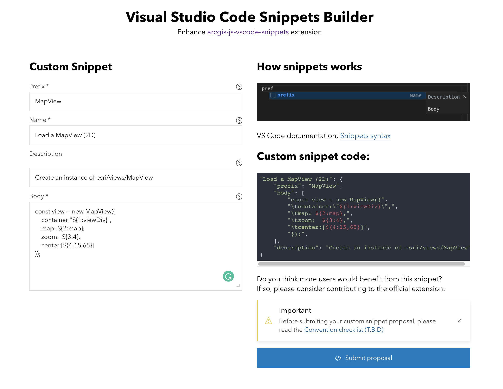

# Snippets builder

This application will help you in the process of contributing to [arcgis-js-vscode-snippets](https://github.com/Esri/arcgis-js-vscode-snippets/blob/master/contributing.md), but it can also be used to create your own custom snippets.

**Live**: [Open Snippet builder](https://esri.github.io/arcgis-js-vscode-snippets/builder).

---

